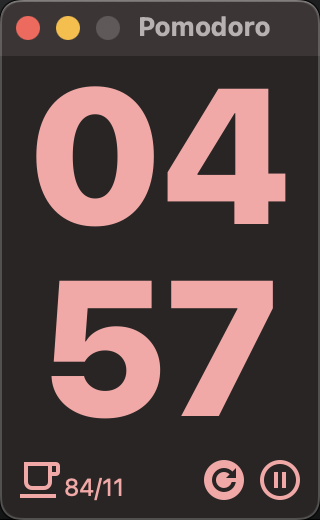

# pomodoro
A simple pomodoro timer write in Tauri and React.

## Screenshots




# Tauri + React + Typescript

This template should help get you started developing with Tauri, React and Typescript in Vite.

## Recommended IDE Setup

- [VS Code](https://code.visualstudio.com/) + [Tauri](https://marketplace.visualstudio.com/items?itemName=tauri-apps.tauri-vscode) + [rust-analyzer](https://marketplace.visualstudio.com/items?itemName=rust-lang.rust-analyzer)


## Install Tauri support

```bash
npm create tauri-app@latest
npm install --save-dev @tauri-apps/cli@latest
npm install
```

## run project

```bash
npm run tauri dev
```

## Build project

```bash
npm run tauri build
`````
